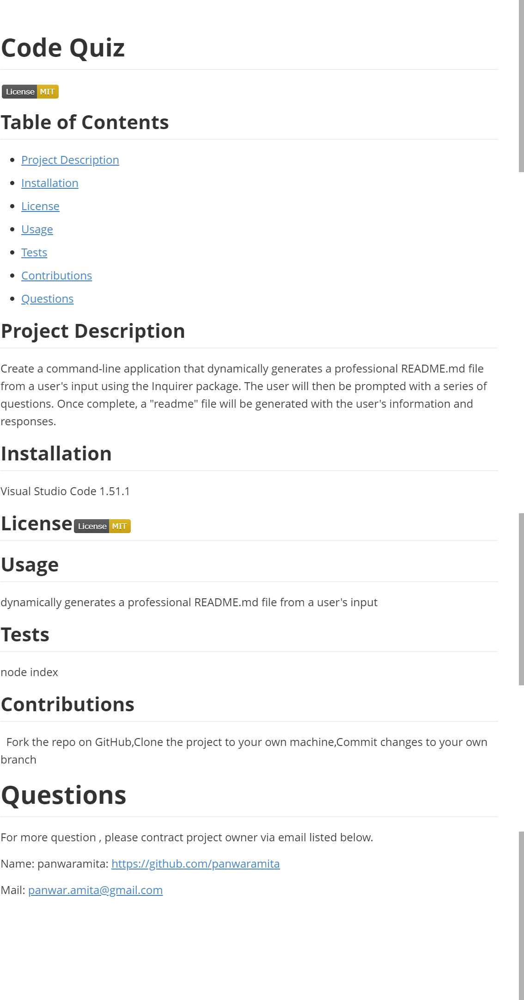

# Readme Generator

## Contents

* [Introduction](#Introduction)
* [Technologies](#Technologies)
* [Screenshot](#Screenshot)
* [Link](#Link)

## Introduction

Create a command-line application that dynamically generates a professional README.md file from a user's input using the Inquirer package.The user will then be prompted with a series of questions. Once complete, a "readme" file will be generated with the user's information and responses.

## Technologies

Project is created with:

* Visual Studio Code 1.51.1
* Node.js

## Screenshot

## Link

[Video Link](https://drive.google.com/file/d/1D6TRyS5CtKfjhesHqjY5daUPC58fj4x3/view?usp=sharing)

